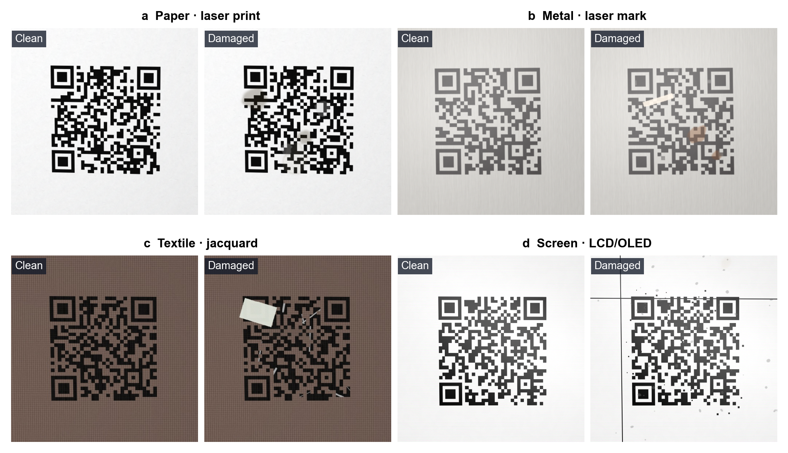
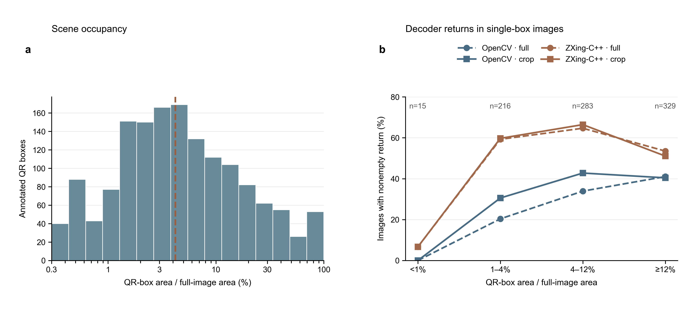
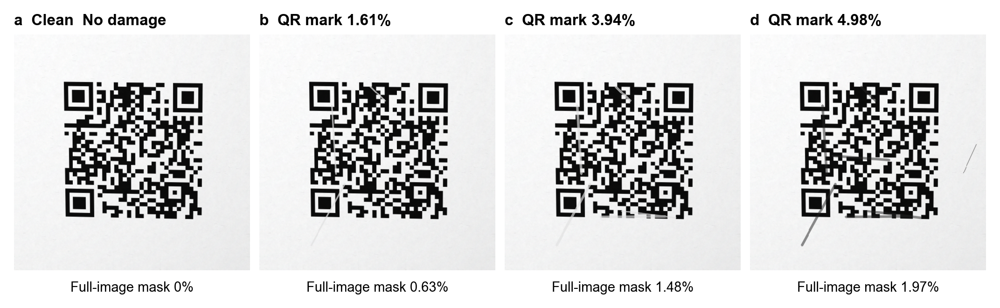
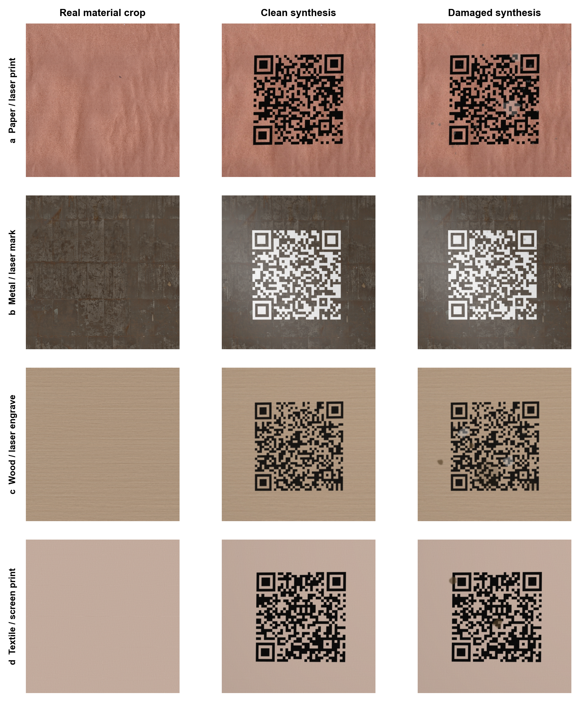
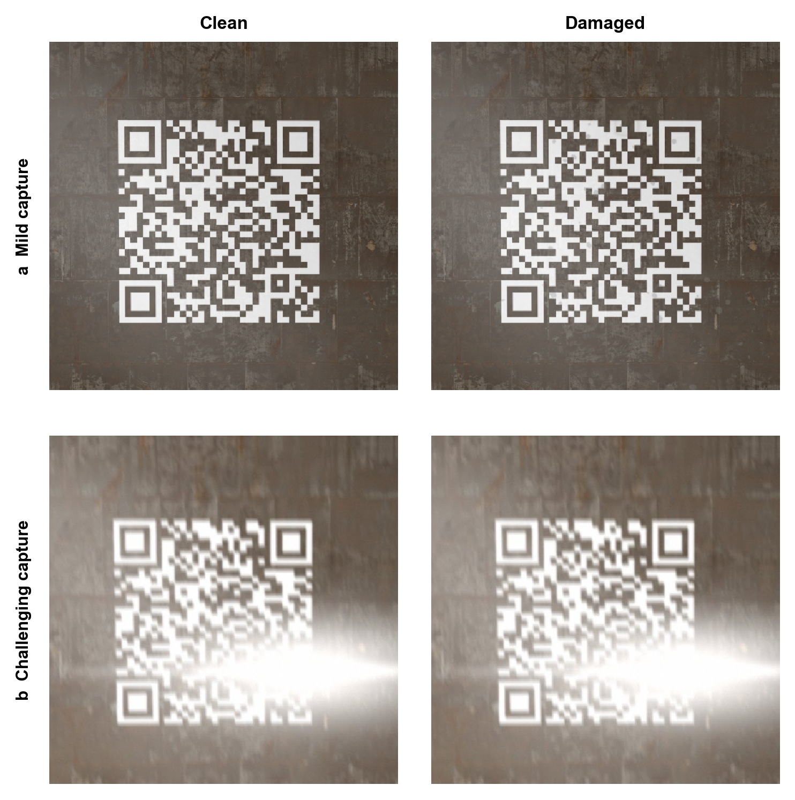

# 面向真实场景外观的 QR 码批量仿真：材质—成码工艺耦合、定量污损与采集退化

> 公开仓库版本：图 2 的外部数据集原图因逐图再发表权尚未核实而暂不附图；其余正文保留作者工作稿的编号与统计。

**稿件类型：** 方法与数据资源论文。2026 年 10 月 7 日整合现有生成代码、合成样本工程核查和外部定位图像审计。图中的外部原图再发表权及逐图拍摄来源仍需投稿前核实。

## 摘要

QR 码附着于纸张、金属、织物或显示屏时，其可见纹理、标记边缘和常见污损随载体与成码方式而变化。逐一制作和采集大量带已知编码内容的实体污损码成本较高，因而需要可批量运行、参数可控且标注可追溯的仿真方法。本文实现以载体材料和成码工艺为条件的生成管线，配置覆盖 15 类载体、50 种载体—成码组合。程序将符号生成、材质背景、成码外观、条件化污损和二维采集变换连接起来；可选择污损类型、抽取数量与作用区域，也可用 YAML 逐项指定出现概率、实例数和算子参数。污损程度定义为污损几何掩码覆盖 QR 黑色标记像素的比例；用户可指定目标比例区间，程序筛选候选样本并记录实际比例。单次运行按所选组合和每组合数量批量输出干净／污损配对图、理想符号、掩码及逐样本参数。原有背景库含 1,500 张 AI 纹理；另建五类来源可追溯材质图像的小库，用于单独的仿真示例。采集层新增运动模糊、强反光和过曝选项。50 种组合各生成两张的工程核查显示，100/100 张输出的尺寸和二值掩码有效；污损图的正确载荷返回数在 OpenCV 和 ZXing-C++ 下分别为 59/100 与 86/100。对外部 QR 定位集的核查得到 1,085 张图像和 1,510 个有效框，码区面积中位数为整图的 4.21%。本文提供参数可追溯的批量生成方法与配对数据，可供后续恢复等任务使用；实物材质来源和采集退化增强了仿真条件的可描述性，但标记区域污损率仍是几何覆盖指标，现有结果尚未证明照片级真实感或真实场景性能。

**关键词：** QR 码；污损仿真；材质条件化；成码工艺；合成数据；配对标注；数据资源。

## 1. 引言

QR 码的编码矩阵和纠错结构由标准定义 [1]，其被相机记录的外观还取决于载体、标记工艺、使用磨损和拍摄条件。纸张上的碳粉、金属上的激光改色、织物中的经纬结构及屏幕像素有不同的纹理和反射表现。单一白底黑码加通用遮挡的合成流程难以显式控制这些关系；为每一种条件制作、污损并拍摄大规模实体码又需要相应设备和人工标注。

受损 QR 码的合成与恢复已有先例。不规则掩码、打印后人工污损、扫描退化、复合照明与模糊等均已被用于 QR 数据构建或恢复研究 [2–7]。本文关注的具体问题是如何把载体材料、成码方式、污损类型和采集变化组织成一条可重复执行的生成链，并保留足以追溯单张样本的编码内容、几何覆盖和参数记录。

为此，我们根据项目中列出的 50 种载体—成码组合建立条件化规则，让用户控制组合范围、每组合样本数、QR 编码参数、目标标记区域污损率与具体算子，并批量生成空间对齐的干净／污损图像和程序定义的掩码。四种机制不同的组合见图 1，固定输入下不同实际污损率的示例见图 4。生成器既能制作近景码图，也能从外部定位框提取码区面积和中心位置，进行小码区尺度压力测试。我们用 100 张合成样本检查输出结构和软件解码返回，用用户提供的 1,085 张外部定位图像描述场景尺度与来源混合性。本文报告的是生成方法、控制接口和可审计数据特征；图像是否达到实体照片的视觉真实感，仍需来源清楚的实体样本作独立研究。

## 2. 相关工作与方法定位

### 2.1 面向 QR 恢复的污损合成

图像修复与恢复研究早于本项目就已生成受损 QR 样本。EHFP-GAN 使用原始符号和不规则掩码，研究不同污染程度下的重建 [2]。面向物流应用的一项恢复研究将合成失真与真实打印码结合，后者被人为书写、刮擦或涂漆 [3]。这些工作表明，合成污损能够支持 QR 恢复研究。本文将载体与成码方式纳入渲染和污损选择，并重点报告生成记录、配对标注和工程核查；现有结果不比较下游恢复模型。

### 2.2 印刷、采集与场景变化

Sancar 的数据集包括不可读的扫描 QR 图像、仿真的不可读图像，以及超分辨率研究所用的生成训练数据 [4,5]。Benito-Altamirano 及其同事研究了经历空白、增强和真实打印—采集通道的彩色 QR 码 [6]。Benito-Altamirano 与 Martínez-Carpena 的另一数据集包含平面和更具挑战性的表面上的 QR 码，并提供空间标注 [8]。BarBeR 汇集了包括 QR 码在内的多种条码制式的真实图像，用于定位基准测试 [9]。这些资源表明，已有研究涉及表面和采集条件。由于其任务定义和标注不同，要进行直接数值比较，需要共同的留出图像、一致的评估定义，以及对原方法的获取与复现。

### 2.3 现有证据与本文定位

既有研究已覆盖符号级遮挡、打印与扫描退化、复合采集噪声以及部分真实破坏样本 [2–8]。因此本文不主张此前没有 QR 污损仿真。本文可核查的贡献是一个可批量调用的条件化生成方法：以载体和成码工艺组织 50 种配置，让污损类型、目标污损率区间和算子参数可选，将干净码、污损图、程序掩码及元数据成对输出，并在工程层面检查这些输出。外部定位集 [11] 仅用于分析码区在整图中的尺度和位置；其逐图物理来源未明，不能代替实体污损验证。

## 3. 方法

### 3.1 任务定义与生成输出

令 \(s\) 表示编码内容已知的 QR 符号，\(c\) 表示载体，\(p\) 表示成码方式，\(b\) 表示采样得到的载体背景，\(d\) 表示污损方案，\(a\) 表示采集状态。仿真器构造污损前渲染 \(R(s,c,p,b)\)、污损后渲染 \(D(R,d;c,p)\)，以及对图像成对施加的变换 \(A(\cdot,a)\)。保存的图像对为 \(x_{\mathrm{clean}}=A(R,a)\) 和 \(x_{\mathrm{damaged}}=A(D(R,d;c,p),a)\)。同一图像对的两个成员使用**同一个采样得到的采集状态**。这一选择可保持逐像素比较所需的图像对齐，但不能将其误认为对同一实体样本拍摄的两张独立照片。

对每个样本，实现会保存污损前彩色图像、污损后彩色图像、原始理想 QR 图像、二值 QR 标记掩码、二值污损并集掩码、二值可见变化掩码，以及 JSON 元数据。QR 与污损掩码描述的是**光学模糊与 JPEG 扩散发生之前的几何覆盖范围**。可见变化掩码表示配对拍摄图中至少一个颜色通道相差超过 5 个灰度级的像素；它是图像差异标签，而非真实物理污损标注。JSON 还包含变换后的 QR 四边形、载体与成码方式 ID、选中的污损层、采样参数值、图像尺寸和阶段种子。

### 3.2 载体—成码方式分类与背景来源

项目配置列出了跨 15 类载体的 50 种载体—成码方式组合，范围从纸张和不干胶标签到金属、玻璃、纺织物、陶瓷及电子显示屏。该清单是仿真的人工选定范围，并非所有 QR 成码方式的普查。每种组合对应一种载体纹理、一种标记渲染方法，以及适用的载体和工艺相关污损规则。并非每种配对都已有独立的实物工艺记录，配置范围不能等同于物理验证范围。

当前背景库中，15 类载体各有 100 张图像，总计 1,500 张，尺寸均为 768 × 768 像素。其清单文件称这些图像是由图像生成模型独立生成的材质纹理；它们在本文中均称为**由 AI 生成的纹理**。采样到的图像会被裁剪并缩放至画布尺寸；逐样本元数据记录相对路径、SHA-256 哈希、源图尺寸和裁剪坐标。若配置的图库不可用，实现可以退回到程序化材质生成。这两条路径都不提供实际带码物体的照片。纹理模型、生成流程、许可与再分发权及近重复情况尚无完整归档，限制了当前资源的公开再现性。

为了降低对 AI 纹理的依赖，我们另外建立了一个可选择的来源可追溯材质小库，包含纸、金属、木材、织物和陶瓷五类各一张图像。纸张素材取自 Wikimedia Commons 上署名作者自制并以 CC0 发布的旧纸纹理 [13]；其余四张为 Poly Haven 提供的 CC0 漫反射材质贴图 [12]。Poly Haven 的材质规范以照片来源为原则，但本文未逐图核实实物采集设备或加工流程。下载脚本保存原始 URL、作者、许可、源文件哈希和像素尺寸；生成时裁剪坐标也进入逐样本元数据。`--background-root assets/backgrounds_real --require-background-library` 可仅从这一小库取图，缺少对应载体图片或读图失败时停止，避免静默退回程序纹理。五张素材尚不足以覆盖 15 类载体，也不是已带码实体的照片；原有 1,500 张 AI 纹理仍作为另一个明确标注来源的库保留。真实来源材质只替换背景输入，不能单独保证合成标记、污损和采集具有实体照片的外观。

### 3.3 符号、编码内容与对比度选择

内部生成符号时，代码使用 `qrcode` 包，并设置四个模块宽的静区。代码先取得 QR 模块矩阵，再以同一整数像素间距重复每个模块，使原始图像的边长达到或超过请求的 420 像素；这避免保存的原始 QR 图像出现不等宽模块。随后合成器将该模块图像缩放至选定的放置尺寸。生成器支持 L、M、Q、H 纠错等级或从中随机选择，也支持由 ID 派生的编码内容，或在 QR 字母数字与字节模式中选择可复现的变长编码内容。可变载荷不包含载体和工艺 ID，以避免内容向类别泄漏。符号版本依据内容长度自动选择；生成的编码内容、版本、纠错等级、静区设置、内容长度、模块数、源图像模块像素间距和源图像边长均写入元数据。也可以加载用户提供的 QR 图像并进行阈值化。加载器尝试使用 OpenCV 解码规范化后的图像，记录推断字符串与源文件哈希；它不能独立核实载荷真值，也不能由此恢复已核实的符号结构参数。在基于编码内容的评估中，这些样本须单独注明来源。

默认的 `closeup` 模式在较窄范围内采样 QR 尺寸和位置。可选的 `external_boxes` 模式从已核查的定位框清单 [11] 抽取面积比例与归一化中心位置，在生成的载体纹理上放置等面积的正方形标记，不复制外部图像像素。模块整数像素间距、边界限制和相机变换可能改变最终面积；元数据同时记录请求值、实际值及清单哈希。该模式用于码区尺度压力测试，周围物体和照片布局尚未被仿真。

在 `external_boxes` 模式启用污损时，默认的空间模式在 QR 邻域施加污损，并使修改在邻域边缘渐隐。现有污损算子因而随小码区缩放，但其尺寸及出现概率仍需实体样本标定。逐样本记录污损与 QR 的重叠比例。另有依赖载体与成码工艺的规则控制白模块是露出材质，还是位于标签底板上。合成器依据局部背景选择标记颜色并报告图像对比度；这一软件指标不是 ISO/IEC 15415 的印刷质量等级 [10]。

### 3.4 成码外观与材质耦合

`ideal` 配置采用项目中干净且具有工艺差异的成码外观。较新的 `material` 配置使已生成的标记与局部载体表面产生轻微耦合。其工艺配置决定标记模块中可见的载体颜色比例、局部纹理与相关颗粒的强度，以及现有 QR 标记掩码**内部**的亚像素边缘覆盖。所模拟的外观示例包括碳粉、多孔材料上的油墨、激光改性表面、织造标记和显示像素。标签单独处理，使标签下方的材料不会明显改变其印刷标记的颜色。该组件改变外观，但不制造缺失模块，也不重新分类 QR 掩码。配置参数尚未根据实体样本测量，不能从这些输出推断其真实视觉匹配程度。

### 3.5 条件化污损生成

污损在 QR 与载体完成污损前合成后施加。规则系统包含 14 个名称的通用污损池，以及依赖载体和成码工艺的污损池。通用池包含灰尘、污渍、划痕、磨损、胶带、手写笔迹和液滴等；金属载体可选择氧化或点蚀，激光标记可选择局部对比度损失。默认只抽取当前组合允许的算子；显式开启兼容性例外时才可跨组合指定污损。这一规则约束防止随机模式把所有污损无差别地施加到每一种表面。

**随机模式与程度定义。** 程序分别在通用、载体专属和工艺相关污损池中按权重进行无放回抽取。`--damage-common`、`--damage-carrier` 和 `--damage-method` 指定各池的抽取数量范围；默认依次为 1–2、0–1 和 0–1。本文以输出图上的 QR 黑色标记区域污损率定义仿真污损程度：若污损并集掩码为 $M_D$、QR 黑色标记掩码为 $M_Q$，则 $r_Q=|M_D\cap M_Q|/|M_Q|$；整图污损面积比例为 $r_I=|M_D|/(H W)$。两者均为几何掩码的像素面积比例，$r_Q$ 不等于受影响 QR 模块的个数比例，也不代表物理破坏深度或载荷信息损失。`--target-qr-damage-ratio l,u` 指定 $r_Q$ 的目标闭区间；程序用独立且可重现的随机种子生成候选，在成对采集几何变换后的掩码上计算 $r_Q$，接受首个落入区间的样本。超过 `--max-damage-attempts` 仍未命中时明确报错，不把范围外样本写成合格样本。旧的 `--damage-severity` 参数仍能改变算子数量或尺寸的默认分布，但只作为候选生成参数，不作为本文的污损程度分类。

**配置模式。** YAML 可以写成随机控制表或按顺序执行的明确污损方案。前者允许逐个算子设置 `enabled`、抽取权重、出现概率、重复实例数和算子参数；后者用 `damage_plan` 逐项指定算子名、启停、概率、实例数、内部算子尺度参数和 `params`。算子参数包括一层内部的斑点／划痕／缺损数 `count`、以像素或相对比例表示的尺寸、透明度 `opacity`，以及向 QR 标记区域偏置的 `qr_bias` 等。`instances=0`、`params.count=0` 或 `enabled=false` 可明确关闭相应作用。`--damage-mode none` 产生无污损的配对参照。代码按方案顺序叠加有效污损层并保存每层掩码；并集掩码、整图覆盖比例与 QR 黑模块掩码重叠比例进入元数据。算子名称表达预期机理，参数分布与真实污损的对应关系尚未由实体样本校准。

### 3.6 成对采集仿真

在污损之后，`capture_pair` 阶段可选择对干净图和污损图施加相同的单应变换、照明场、白平衡偏移、反射高光、高斯模糊、噪声实现和可选的 JPEG 变换。它以最近邻插值变换几何掩码，并记录变换后的 QR 四边形。`none`、`mild` 和 `handheld` 为原有采集模式；当前默认使用 `mild`，另有独立的 `challenging` 模式。这是具有小幅透视变化的二维图像模型。它不仿真真实三维褶皱、曲面、依据实测双向反射分布函数产生的镜面反射，也不仿真经过标定的相机传感器。这些设定使管线可控；其分布是否符合真实手持拍摄，必须在留出的采集图像上检验。

新增的 `challenging` 采集模式在同一个采样状态中引入直线运动点扩散函数、以曝光值（EV）表示的线性曝光增益，以及在反光载体上较常出现的椭圆形强反光与窄亮带。未指定参数时，运动核长度从 3、5、7、9、11 像素中抽取并归一化，是否启用运动、正曝光增益和强反光也分别采样；强反光先在线性光域叠加，再经 sRGB 映射发生截断。用户还可以用 `--capture-motion-px`（0 或 3–31 的奇数）、`--capture-exposure-ev`（−2 至 3 EV）和 `--capture-glare-strength`（0–2.5）固定三项强度，未固定的效应继续随机采样。这里的 0 分别关闭新增的直线运动核或强反光分量；基础高斯模糊、环境照明和反射载体的弱高光仍由原采集模型决定。逐样本元数据记录请求值、运动核长度和角度、曝光 EV、强反光参数及干净图中接近纯白的像素比例。三类效应与透视、照明、噪声和压缩一起作用于干净／污损配对图，几何掩码仍只记录符号与污损足迹。`mild` 和原有 `handheld` 的参数路径不因新增模式而改变。运动卷积是图像域近似，不能再现逐行读出、三维表面法线或实测镜面反射；强光和运动参数均为工程范围，尚未按相机和材质测量标定。

### 3.7 可复现性与实现边界

每个输出样本使用 NumPy `SeedSequence`，从基础种子、组合 ID、样本索引和阶段标识派生彼此分离的阶段种子。因此，干净合成、污损、采集、QR 内容以及可选的定位框布局采样使用相互独立且确定性的随机流。该设计旨在使某张图像的输出不受同一次运行中生成其他哪些组合的影响。要完整复现，还须归档精确的代码修订版、依赖版本、背景源文件、配置文件和图像编解码行为；下文的小规模哈希检查只验证了更窄的性质。主要 Python 入口为 `synthesize_with_damage.py`，依次调用载体合成器、条件化污损引擎和采集模块。

### 3.8 批量合成与后续使用接口

主入口以 `--combo-ids` 选择组合，以正整数 `--per-combo` 决定每组生成数量，并通过 `--size`、`--seed`、二维码纠错等级与载荷参数、背景目录、渲染配置、采集模式和污损配置决定输出。若选中 \(K\) 种组合，每组请求 \(n\) 张，完整运行将写出 \(K n\) 个样本。例如选择全部 50 种组合并令 `--per-combo 100`，目标输出为 5,000 组图像；本文的实际工程核查只运行了每组 2 张，共 100 组，未测量 5,000 组运行的速度或存储开销。程序按组合建立目录，将 `clean_images`、`damaged_images`、`qr_original`、三类掩码与逐样本 JSON 分别保存，并在 `run_manifest.json` 记录命令参数、所选组合、每组数量和完成状态。逐样本 JSON 另存目标区间、尝试次数、命中候选种子、采集后的 $r_Q$ 和整图面积比例。一次已实际执行的单样本调用将目标 QR 黑色标记区域污损率设为 1%–10%：

```powershell
python synthesize_with_damage.py --combo-ids 1 --per-combo 1 --size 512 --seed 24680 --damage-mode random --target-qr-damage-ratio 0.01,0.10 --max-damage-attempts 8 --output _qa_damage_ratio_target
```

同一入口还可用 `--damage-mode config --damage-config damage_configs/damage_plan_example.yaml` 执行逐项污损方案，或以 `--damage-rules-dir` 指向自定义规则。现有 `prepare_restoration_dataset.py` 可把一次完整输出整理为引用原图文件的配对清单；这使生成图能够作为后续复原、定位与识读鲁棒性研究的输入，但本文没有报告这些应用的训练或性能结果。批量数量由命令参数决定，可处理的实际规模仍受设备运行时间、磁盘容量及生成素材可用性限制。

## 4. 工程核查与外部数据审计

### 4.1 合成样本与核查指标

工程核查使用固定基础种子 24680，为 50 种组合各生成 2 张 512 × 512 图像，共 100 张。生成配置为 `material` 成码渲染、`mild` 二维采集、随机选择 L/M/Q/H 纠错等级，并请求 36—72 字符的 QR 字母数字模式载荷。逐样本检查干净图、污损图、掩码尺寸是否一致，以及几何掩码是否只有 0 和 255 两个取值。OpenCV `QRCodeDetector` 5.0.0 与 ZXing-C++ 3.1.1 分别对理想原码、干净合成图和污损合成图进行常规扫描；未返回字符串时按预定流程尝试反相图。生成载荷已知，因而本节可以计算完全匹配数。每组合仅两张，计数用于排查实现问题，不用于估计该组合的总体识读概率。

### 4.2 外部定位图像的范围与处理

用户提供的外部集合来自 GitCode 仓库 [11]，包含 1,085 张图像和 VOC／YOLO 定位标注。我们保留原始文件，只读入图像尺寸、定位框和现有数据划分；当 VOC 可用时以其为准，否则使用 YOLO 标注。对每个有效框导出保留原分辨率、四周各增加 20% 上下文的码区裁剪。原图及裁剪使用两种软件解码器记录**非空返回**，但外部集合没有独立记录的编码内容，因此该指标不是正确载荷率。以 SHA-256 检测完全相同的文件，并建立按相同哈希分组的辅助划分。图 2 用四张原图展示集合中的视觉形式；样例按外观差异选取，不代表随机抽样，也不用于证明照片或污损的真实性。

### 4.3 场景尺度参数的再利用

对于可选的 `external_boxes` 布局，程序从外部定位框清单抽取面积占比与归一化中心位置，再在内部生成的材质背景上安放等面积的正方形 QR。该步骤只使用数值几何，不复制外部图像像素。QR 模块的整数像素间距、边界裁切和后续透视变换会使实际面积偏离抽样目标；请求值、实现值和清单哈希均保存在元数据中。小码区模式可在 QR 邻域施加污损并使边缘渐隐。它是图像尺度和算法边界的压力测试，不包含照片中的物体、文字或完整场景布局。

### 4.4 真实来源材质与强采集路径的小规模检查

从五类新素材中各选一张，选择纸张激光打印、金属激光标记、木材激光雕刻、织物丝网印刷和陶瓷丝网印刷五个组合，各生成一组 512 × 512 配对图。所有样本使用同一基础种子、材质库、透明白模块和随机污损；分别以 `mild` 和 `challenging` 采集模式运行。两次运行中，同一组合的载荷、背景文件哈希及背景裁剪坐标一致，因而可观察采集参数的影响。用原有文件检查程序核对输出尺寸、二值掩码和已知载荷返回。每组合仅一组，结果仅作新代码路径的功能检查，不估计材料真实性或解码概率。

## 5. 结果

### 5.1 生成范围与可观察输出

批量入口按组合 ID 与每组合数量组织生成任务，并为每个样本保存图像对、掩码、参数和运行索引。当前配置文件包含 15 类载体和 50 种载体—成码组合（表 1）。四组固定索引的示例展示了纸张激光打印、金属激光标记、织物提花和 LCD/OLED 屏幕的干净与污损配对图（图 1）。配对图共享同一次采集变换，因而污损位置可在两图间直接比较；不同载体的基底纹理和标记对比度也在示例中可见。示例只展示程序输出的多样性，不构成与真实材质的盲法相似度比较。背景库的 1,500 张纹理均为 AI 生成，逐图来源和许可仍需补齐。

**表 1｜载体—成码工艺配置范围。** 数量来自项目配置文件，表示实现的组合数，并非全部物理可行工艺的普查。

| 载体类别 | 组合数 | 配置中的成码方式示例 |
| --- | ---: | --- |
| 纸张 | 4 | 激光、喷墨、胶印、热敏打印 |
| 不干胶标签 | 3 | 热敏、热转印、数码喷墨 |
| 瓦楞纸板 | 3 | 柔印、工业喷墨、贴标 |
| 塑料包装 | 4 | 凹印、柔印、UV 喷墨、热转印 |
| 纸盒 | 2 | 胶印、数码打印 |
| 金属 | 4 | 激光标记、激光雕刻、丝网印刷、UV 印刷 |
| 塑料外壳 | 4 | 激光标记、移印、丝网印刷、贴标 |
| 玻璃 | 4 | 丝网印刷、UV 印刷、激光蚀刻、贴标 |
| 木材 | 4 | 激光雕刻、激光烧蚀、UV 印刷、丝网印刷 |
| 纺织物 | 5 | 丝网印刷、热转印、直喷、提花、刺绣 |
| 陶瓷 | 3 | 丝网印刷、热转印、釉下彩 |
| 亚克力／PVC | 3 | UV 印刷、丝网印刷、激光雕刻 |
| 海报 | 3 | 喷绘、照片打印、卷材 UV 印刷 |
| 票据／卡片 | 3 | 热敏、热转印、数码打印 |
| 显示屏 | 1 | LCD／OLED 显示 |
| **合计** | **50** | **15 类载体** |



**图 1｜材质与成码工艺条件化的合成 QR 码配对示例。** a 纸张／激光打印；b 金属／激光标记；c 纺织物／提花；d 屏幕／LCD–OLED。每组左侧为污损前、右侧为污损后的配对拍摄仿真图，均为对应组合的 `000000` 样本。图像是程序生成数据，非实拍照片；图中外观不代表对该材料的物理标定结果。公开仓库的 `examples/engineering_50/` 保存这四组图像及逐样本元数据。

### 5.2 文件有效性与软件可读性

全部 100 张合成样本的干净／污损图与掩码尺寸一致，掩码仅含二值。理想原码、干净合成图和污损合成图的准确载荷返回计数见表 2。OpenCV 对污损图返回 59/100，ZXing-C++ 返回 86/100；两者差异说明“可读”取决于软件实现及重试流程。这些数值既不是印刷质量等级，也不评价照片真实感。对第 17 号组合的生成顺序检查中，全量运行与只生成该组合时的 14 个对应文件哈希一致。另一次场景尺度探针在两个组合中生成 4 张图，均通过图像和掩码尺寸检查；QR 邻域污损的变更和掩码未越出记录的邻域边界。

**表 2｜100 张合成样本的工程核查。** 数字为与内部生成载荷完全一致的样本数；各栏使用相同 100 个样本，非空但错误的内容计失败。

| 保存图像阶段 | 尺寸与二值掩码有效 | OpenCV 准确载荷 | ZXing-C++ 准确载荷 |
| --- | ---: | ---: | ---: |
| 理想原码 | 100/100 | 99/100 | 100/100 |
| 干净合成图 | 100/100 | 92/100 | 100/100 |
| 污损合成图 | 100/100 | 59/100 | 86/100 |

### 5.3 外部图像的场景尺度与来源混合性

外部集合的 1,085 张图像中，1,037 张有 VOC 标注，共得到 1,510 个有效 QR 框；48 张没有定位标注，194 张含多个框（表 3）。QR 框面积占整图面积的中位数为 4.21%，短边中位数为 104 像素（图 3a）。完全相同文件构成 42 组，其中 17 组跨原始训练、验证或测试划分；哈希分组的新划分避免完全相同文件跨组，但不能识别缩放或裁剪形成的近重复。

图 2 展示了该集合中看起来像现场与手持拍摄的图像、宣传卡片及插画。第一张图没有可用定位框，因而未计入图 3 的框统计。仅凭这些像素不能核实拍摄来源、实体材质和真实污损类型。OpenCV 对整图的非空返回数为 325/1,085，对至少一个码区裁剪有返回的图像数为 395；ZXing-C++ 的相应数字为 635 和 599。图 3b 进一步展示了单框图像随码区面积变化的返回比例。缺少独立载荷真值时，这些数字不能写成正确识读率。

**表 3｜外部 QR 定位集的审计统计。** 数据仅描述本地副本的文件、定位框与解码器返回。

| 项目 | 数量或中位数 |
| --- | ---: |
| 原始图像 | 1,085 |
| 有 VOC 定位标注的图像 | 1,037 |
| 有效 QR 框 | 1,510 |
| 无定位标注图像 | 48 |
| 多 QR 框图像 | 194 |
| QR 框面积／整图面积 | 4.21% |
| QR 框短边 | 104 像素 |
| 完全相同图像组 | 42 |
| 跨原始划分的完全相同图像组 | 17 |

> **公开版图 2 暂不附原图。** 外部定位集逐图再发表权未核实；作者本地论文工作稿保留原图供核查。

**图 2｜外部 QR 定位集中的四种图像形式（公开版缺图）。** 作者本地审计记录：a `QR-00589`，看起来像公共空间拍摄；b `QR-01016`，看起来像手持卡片拍摄；c `QR-01063`，宣传卡片图；d `QR-00108`，插画。这些描述不等于逐图来源认证，四图也未被确认为物理污损真值。原图来自用户提供的 GitCode 集合 [11]；逐图再发表权待核实。



**图 3｜外部数据集的码区尺度与解码器非空返回。** a 1,510 个有效框占整图面积的分布，虚线为中位数 4.21%；b 843 张单框图像按码区面积分层后，整图及保留 20% 上下文裁剪的 OpenCV、ZXing-C++ 非空返回比例。每一层上方标注图像数；来源数据见 `real_dataset_audit/figure_A1/`。曲线并非载荷正确率，也不评价图像的照片真实性。

### 5.4 基于标记区域污损率的程度表征与批量接口

图 4 固定纸张／激光打印组合的同一张干净合成图、同一种划痕算子及随机种子，改变划痕数和宽度后，以实际掩码面积而非预设标签标识三种结果。QR 黑色标记区域污损率 $r_Q$ 分别为 1.61%、3.94% 和 4.98%；对应的整图污损面积比例 $r_I$ 分别为 0.63%、1.48% 和 1.97%。划痕数分别为 3、5、7，宽度范围分别为 1–2、1–3、1–4 像素。图中数值描述一次特定运行的几何覆盖，不代表任意算子参数下的必然单调关系，也不等于实体损伤等级。此图为单独展示污损引擎，在已保存的干净采集图上施加划痕；正式批量管线则在成对采集变换之前施加污损。

50 种组合各 2 张的运行已产生 100 组样本并完成表 2 所列文件检查。`--per-combo` 参数使同一入口能够请求更多样本，例如 50 组各 100 张对应 5,000 组目标输出；本文没有执行这次 5,000 组运行，也没有报告吞吐率或磁盘占用的规模实验。可调规则与批量输出结构是方法实现的能力，当前证据限于已完成的工程核查。

目标区间筛选另以第 1 号组合运行 1 张 512 × 512 图像。设定 $r_Q\in[0.01,0.10]$ 和最多 8 次候选后，第 2 次候选被接受，输出掩码的 $r_Q$ 为 1.86%。相同命令重跑后，干净图、污损图、三类掩码和逐样本 JSON 的 SHA-256 均相同。这是一组功能与确定性检查，未检验所有组合和所有目标区间的命中概率。



**图 4｜实际 QR 标记区域污损率表征。** a 已保存的干净纸张／激光打印合成图；b–d 为同一划痕算子和随机种子下不同参数的输出，面板标注实测 $r_Q$。对应的整图污损面积比例与具体参数见 `figures/Fig_4_damage_ratio_source.csv`。本图是污损引擎的单独演示，在已采集图上加污损；完整生成管线的次序为先污损、再成对采集。这些比例是掩码面积度量，未通过实体损伤标定。

### 5.5 来源可追溯材质上的合成示例

五类来源可追溯材质各成功生成一组配对图，背景元数据均指向预期原始文件；图 5 展示其中四类的实际裁剪、干净合成图与污损图。纸张、金属、木材和织物的真实来源纹理在 QR 周围和标记空隙中可见，避免了以单色背景或未说明来源的 AI 纹理充当所有材料。第五类陶瓷样本也通过文件检查，但不在图 5 中展示。`mild` 路径下 5/5 组图像与掩码有效，OpenCV 和 ZXing-C++ 对 5/5 张干净图及 5/5 张污损图均返回已知载荷；这只是五个固定样本的软件返回，不能证明真实感优于旧背景库。由于 Poly Haven 贴图提供的是材料表面，而非真实印刷 QR 的实物照片，图 5 的中、右栏仍属于仿真图像。



**图 5｜来源可追溯材质上的 QR 码合成。** a 纸张／激光打印；b 金属／激光标记；c 木材／激光雕刻；d 织物／丝网印刷。左栏为本次生成实际抽取的原始材质裁剪，中、右栏为同一底图上的干净与污损合成图。纸张素材来自 Wikimedia Commons [13]，其余来自 Poly Haven [12]；逐图 URL、许可和源文件哈希见 `qr/assets/backgrounds_real/provenance.json`，图像对哈希见 `figures/Fig_5_real_material_sources.json`。左栏只证明背景来源，不证明合成 QR 已达到实拍外观。

### 5.6 运动模糊、强反光与过曝的采集示例

图 6 对照了同一金属材质裁剪、同一 QR 载荷和同一污损生成配置下的 `mild` 与 `challenging` 采集。后者在本次固定种子运行中记录了 9 像素直线运动核、1.19 EV 的曝光增益和强反光亮带；干净图中三个通道均达到 250 及以上的像素比例为 9.24%。图中可以观察到码区边缘扩散和局部饱和。五组新素材在 `challenging` 模式下均通过文件与二值掩码检查；OpenCV 和 ZXing-C++ 对其中 4/5 张干净图、4/5 张污损图返回了已知载荷。另用金属组合固定 9 像素运动核、1.0 EV 与 1.2 的反光强度运行一组，元数据与请求值一致，几何掩码有效；这一刻意加重的样本中两种解码器均未返回载荷。上述计数来自固定的小样本功能检查，不能解读为两模式的总体识读率差异，也不能证明所加高光与真实相机一致。运动模糊、过曝和反光归于**采集退化**，不计入前述 QR 标记区域的几何污损率。



**图 6｜采集退化的受控对照。** 上行为 `mild`，下行为 `challenging`；左列干净图，右列污损图。两次运行共享生成载荷、材质源文件和裁剪坐标。下行示例包含运动模糊、强反光与正曝光增益，具体参数与输出哈希见 `figures/Fig_6_acquisition_sources.json`。两行仍是仿真图，而非同一实体 QR 的两次照片。

## 6. 讨论

本文提供的是一套可批量执行、按载体与成码工艺选择外观和污损机制的生成方法。与只处理污损码恢复或特定表面／采集条件的既有工作 [2–8] 相比，方法上的重点是把 50 种组合、标记区域污损率控制、采集退化和逐样本溯源放在同一管线中。100 组样本的工程核查表明这条管线能够输出完整配对记录，并给出了指定解码器下的返回情况；样本量不足以估计各组合的稳定性能，也未提供与其他仿真方法的优劣比较。解码器间的差异进一步说明，可读性结果必须连同软件版本和尝试规则报告。

标记区域污损率 $r_Q$ 描述几何污损掩码覆盖原始深色标记的像素面积，便于按目标区间抽样和构造固定载体的受控对照；它不等于受损模块数、材料损伤深度或拍摄后可见像素变化。图 4 的划痕示例只验证该算子在三次输出中形成不同覆盖率。来源可追溯材质和运动模糊、反光、曝光算子扩展了可模拟的外观条件，但五类材质的功能样例与图 5、6 不能证明生成图更接近实体照片。现有二维光照和贴图还可能使 QR 标记跨越金属拼缝或砖缝，无法表达曲面、褶皱及经标定的镜面反射。

外部图像的 1,510 个定位框提供码区尺度参照，可用于设定小码区压力测试；这些标注没有已知载体、成码工艺、实体污损或载荷真值。按外部框放置二维码仅迁移了尺度与位置，材质背景中仍缺少实际场景的物体布局。外部仓库的逐图来源与再发表权利也未核实 [11]，因此作者本地稿的图 2 不随公开代码再分发；大规模默认 AI 纹理的生成来源与发布许可仍待归档。

公开的代码和配对图像接口可为后续污损复原训练、定位裁剪和解码鲁棒性研究提供可配置输入；本文没有训练模型、测量大规模吞吐或验证这些应用的增益。要检验“更真实”这一目标，需要制作载体、工艺、污损和相机条件均有记录且可合法再发表的实体样本，在相同条件下开展盲法视觉比较及图像分布分析。软件解码率可补充评估可读性，不能替代视觉真实感证据。

## 7. 结论

我们实现了覆盖 15 类载体、50 种载体—成码组合的 QR 码与污损图像批量仿真管线。该方法将条件化成码外观、可选择的污损类型、目标标记区域污损率及逐算子参数与成对采集连接，并输出可追溯的配对图像、掩码和元数据。100 组样本的工程核查验证了输出结构；五类来源可追溯材质和新增的运动模糊、强反光、过曝路径通过小规模功能检查；外部 1,085 张图像的审计提供了码区尺度参照。该生成工具可为后续复原训练等任务提供可配置的样本来源。实体照片视觉真实感、大规模吞吐和应用效果仍需独立验证。

## 数据与代码可用性

仿真器代码、50 种组合配置、污损规则、五类来源可追溯材质、少量配对样本、中英文公开稿及聚合工程核查结果已发布于 [GitHub 仓库](https://github.com/Ethan-Yue/qr-realistic-simulator) [14]。本文引用的固定代码版本为提交 [`34239b8`](https://github.com/Ethan-Yue/qr-realistic-simulator/tree/34239b8aadf93682b5c31204cdb2acaafa4d8b63)；后续 `main` 分支更新不改变该快照。仓库中的代码采用 MIT 许可，论文文字与作者制作的图示采用 CC BY 4.0；第三方材质图的逐项来源、许可和哈希见 `qr/assets/backgrounds_real/provenance.json`。

公开仓库提供图 1、3–6 的 PNG、部分参数记录、图 3 的聚合 CSV、绘图代码和审计摘要，不含 100 样本运行所用的全部 AI 纹理和原始输出，因而目前不能仅凭公开文件逐样本重算文中所有数字。外部图像集来源见 [11]；其原图以及作者本地稿图 2 不在公开仓库中，图像的逐项再发表权利仍待核实。默认 AI 纹理库的生成来源与发布许可也尚未完成归档。

## 参考文献

1. ISO/IEC. *ISO/IEC 18004:2024: Information technology—Automatic identification and data capture techniques—QR code bar code symbology specification*. International Organization for Standardization (2024). [Official record](https://www.iso.org/standard/83389.html).
2. Zheng, J. *et al.* EHFP-GAN: Edge-Enhanced Hierarchical Feature Pyramid Network for Damaged QR Code Reconstruction. *Mathematics* **11**, 4349 (2023). [https://doi.org/10.3390/math11204349](https://doi.org/10.3390/math11204349).
3. Muallim, T., Kucuk, H., Bareket, M. & Kahraman, M. Lightweight Deep Learning Model and Novel Dataset for Restoring Damaged Barcodes and QR Codes in Logistics Applications. *Computer Modeling in Engineering & Sciences* **143**, 3557–3581 (2025). [https://doi.org/10.32604/cmes.2025.064733](https://doi.org/10.32604/cmes.2025.064733).
4. Sancar, Y. Reconstructing unreadable QR codes: a deep learning based super resolution strategy. *PeerJ Computer Science* **11**, e2841 (2025). [https://doi.org/10.7717/peerj-cs.2841](https://doi.org/10.7717/peerj-cs.2841).
5. Sancar, Y. *QR Code Dataset V2*. Figshare (2025). [https://doi.org/10.6084/m9.figshare.28424213](https://doi.org/10.6084/m9.figshare.28424213).
6. Benito-Altamirano, I., Martínez-Carpena, D., Casals, O., Fàbrega, C., Waag, A. & Prades, J. D. A dataset of color QR codes generated using back-compatible and random colorization algorithms exposed to different illumination-capture channel conditions. *Data in Brief* **46**, 108780 (2023; online 2022). [https://doi.org/10.1016/j.dib.2022.108780](https://doi.org/10.1016/j.dib.2022.108780).
7. Zhang, H. *et al.* A lightweight causal Mamba network for blurred QR code image restoration. *Scientific Reports* **16**, 18932 (2026). [https://doi.org/10.1038/s41598-026-49128-4](https://doi.org/10.1038/s41598-026-49128-4).
8. Benito-Altamirano, I. & Martínez-Carpena, D. *A dataset of QR Codes on top of different surfaces (flat and challenging surfaces)*. Mendeley Data, version 1 (2023). [https://doi.org/10.17632/m6mfwc52vk.1](https://doi.org/10.17632/m6mfwc52vk.1).
9. Vezzali, E., Bolelli, F., Santi, S. & Grana, C. BarBeR: A Barcode Benchmarking Repository. *Proceedings of the 27th International Conference on Pattern Recognition* (2024). [Author-institution record](https://iris.unimo.it/handle/11380/1350766); [dataset documentation](https://ditto.ing.unimore.it/barber/).
10. ISO/IEC. *ISO/IEC 15415:2024: Automatic identification and data capture techniques—Bar code symbol print quality test specification—Two-dimensional symbols*. International Organization for Standardization (2024). [Official record](https://committee.iso.org/standard/76876.html?browse=ics).
11. Open-source-toolkit. *二维码数据集*. GitCode，`main` 提交 `3b76bb18bfcc68fa105873fc7b3e5509e555d3a5`（2026 年 10 月 6 日访问）。[仓库 README](https://gitcode.com/open-source-toolkit/24565/blob/main/README.md)。仓库作者身份及逐图来源待核实。
12. Poly Haven. *Asset License; Texture Requirements; material assets*. 2026 年 10 月 7 日访问。[许可](https://polyhaven.com/license)；[纹理规范](https://docs.polyhaven.com/en/technical-standards/textures)；[素材目录](https://polyhaven.com/textures)。本研究使用的各素材页及哈希列于 `qr/assets/backgrounds_real/provenance.json`。
13. Iroi su. *Текстура бумаги*（旧纸纹理）. Wikimedia Commons，CC0 1.0（2010；2026 年 10 月 7 日访问）。[文件及许可页](https://commons.wikimedia.org/wiki/File:%D0%A2%D0%B5%D0%BA%D1%81%D1%82%D1%83%D1%80%D0%B0_%D0%B1%D1%83%D0%BC%D0%B0%D0%B3%D0%B8.jpg)。
14. Ethan-Yue. *QR Realistic Simulator: carrier–marking-conditioned QR image and damage synthesis*. GitHub（2026）。[项目仓库](https://github.com/Ethan-Yue/qr-realistic-simulator)；[固定代码版本，提交 `34239b8`](https://github.com/Ethan-Yue/qr-realistic-simulator/tree/34239b8aadf93682b5c31204cdb2acaafa4d8b63)。
